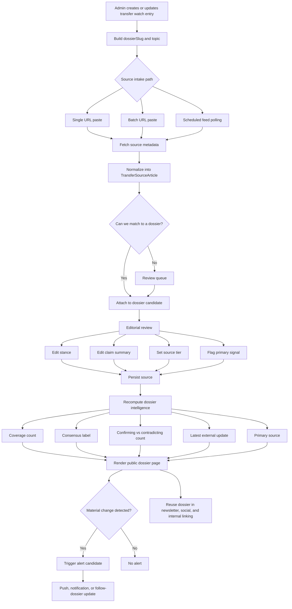
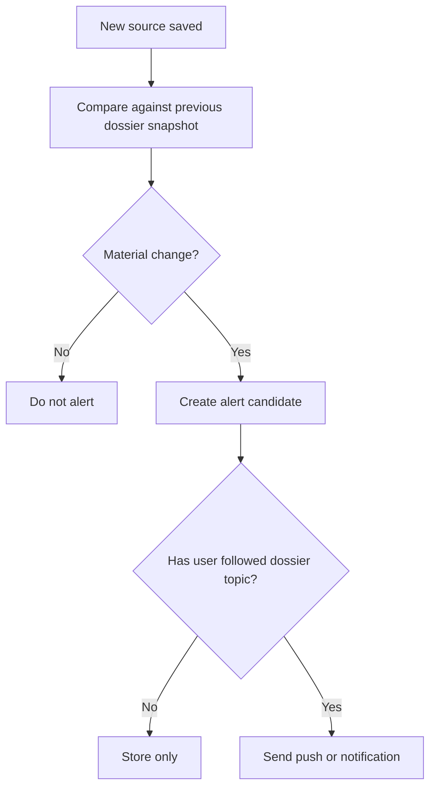
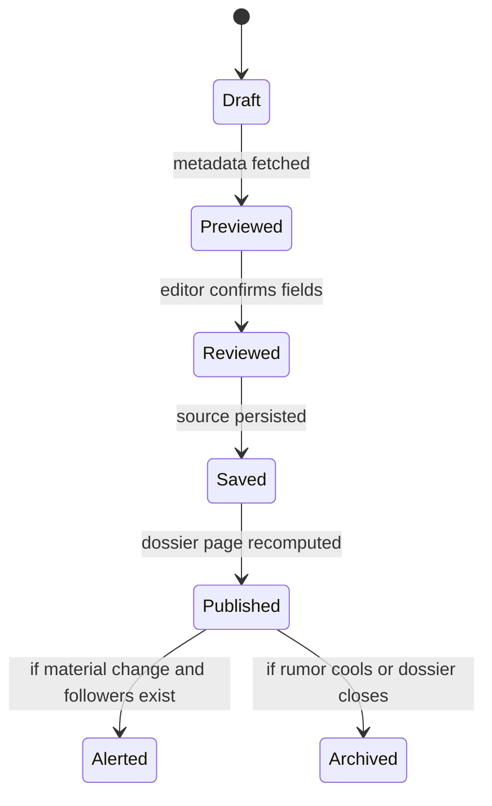

# Transfer Dossier V2 Workflow

This document describes how the `Transfer Dossier v2` feature should operate inside the current Pitchside / Touchline Dribble product.

The goal is to turn each dossier into a source-aware transfer intelligence page that combines:

- internal editorial scoring
- external linked coverage
- manual editorial review
- followable alerting
- downstream reuse for newsletter, push, and social distribution

## Core Idea

Each transfer dossier starts from a `transferWatch` entry and becomes the canonical home for a transfer saga.

That dossier is then enriched with:

- external source links from outlets like BBC, ESPN, The Athletic, club sites, and major reporters
- a computed consensus layer
- a timeline of signal changes
- internal content connections

## Main Entities

- `TransferWatchEntry`
  The base dossier record: player, destination club, source tier, status, fee, take, scout grades.

- `TransferSourceArticle`
  A normalized external source item attached to a dossier.

- `dossierSlug`
  Canonical URL identity for a saga, e.g. `/transfers/player-to-club`.

- `topic`
  Normalized follow/alert key for a saga.

## Workflow Summary

1. Admin creates or updates a transfer watch entry.
2. The system derives the dossier identity from player + club.
3. External source links enter through URL paste, batch paste, or scheduled polling.
4. The system previews and normalizes metadata from the source.
5. The source is matched to a dossier.
6. An editor confirms or adjusts stance, summary, and importance.
7. The source is saved and the dossier intelligence is recomputed.
8. The public dossier page updates.
9. Followers can be alerted if the new source materially changes the saga.
10. The dossier can feed newsletter, push, and social publishing flows.

## Mermaid Flowchart

## Intake Paths

### 1. Single URL Paste

Best for MVP.

Editor pastes a source URL and the system tries to extract:

- title
- canonical URL
- outlet
- reporter
- publish time
- paywall hint
- candidate stance
- draft claim summary

This path should always allow manual correction before save.

### 2. Batch URL Paste

Useful for transfer windows when one rumor is reported across many outlets.

Workflow:

1. Paste multiple URLs.
2. Preview each item.
3. Drop failed or duplicate ones.
4. Save approved items in one action.

### 3. Scheduled Feed Polling

Best as a later-stage automation layer.

Workflow:

1. Poll approved RSS feeds or stable index pages.
2. Detect transfer-like stories.
3. Normalize metadata.
4. Attempt auto-match to a dossier.
5. Send uncertain matches to review.

## Matching Logic

The source matcher should work in this order:

1. explicit `dossierSlug`
2. exact `player + club`
3. exact `topic`
4. fuzzy `player + destination club`
5. fallback to review queue

The system should never silently attach a weak match without editorial confirmation.

## Editorial Review Rules

Each source should be reviewed for:

- `stance`
  `advances`, `confirms`, `analysis`, `contradicts`, `official`

- `claimSummary`
  A short in-house summary of what the source says.

- `sourceTier`
  Editorial trust level for that source item.

- `isPrimaryReport`
  Whether this is the leading signal for the dossier.

- `notes`
  Internal-only context for future editing.

## Dossier Intelligence Outputs

Once sources are saved, compute:

- `coverageCount`
- `confirmingCount`
- `contradictingCount`
- `officialCount`
- `lastExternalUpdateAt`
- `primarySource`
- `consensusLabel`

Suggested consensus behavior:

- `Strong`
  Official confirmation or multiple aligned strong sources.

- `Mixed`
  Conflicting reporting or only partial multi-source support.

- `Low`
  Thin source stack or early rumor-only coverage.

## Public Dossier Page Sections

The upgraded dossier page should show:

1. Hero block
   Player, clubs, status, board score, fee signal, follow button.

2. External signal desk
   Coverage count, consensus, latest update, linked source cards.

3. Internal signal timeline
   Your own board logic and editorial path.

4. External timeline
   Chronological list of source updates.

5. Editorial take
   Your own analysis and market context.

6. Related internal coverage
   Your posts and stories about the same rumor lane.

7. Adjacent dossiers
   Similar saga cards around the same club.

## Alert Workflow

An alert candidate should be created when a source:

- upgrades consensus materially
- introduces a contradiction
- becomes the first official confirmation
- comes from a newly important source

Recommended alert flow:

## Automation Guardrails

Automatic scraping should follow these rules:

- prefer metadata extraction first
- prefer outbound links over mirrored article text
- never rely on brittle full-page parsing as the only system
- send weak matches to manual review
- keep editorial control over stance and summary

## Recommended MVP Scope

Build in this order:

1. Transfer watch entry remains the dossier anchor.
2. Add single-URL preview.
3. Save normalized linked source items.
4. Show source cards on dossier page.
5. Compute and display consensus.
6. Add source timeline.
7. Add follower alerts for material changes.

Phase 2:

- batch URL import
- scheduled RSS/source polling
- review queue for uncertain matches
- auto-generated publishing outputs

## State Transitions

## Operational Notes

- Keep `TransferWatchEntry` as the base dossier object.
- Keep `TransferSourceArticle` separate from the core watch model.
- Persist source intelligence with site settings for MVP consistency.
- Add a dedicated source-preview endpoint for assisted ingestion.
- Use manual approval before anything becomes part of the public intelligence layer.
